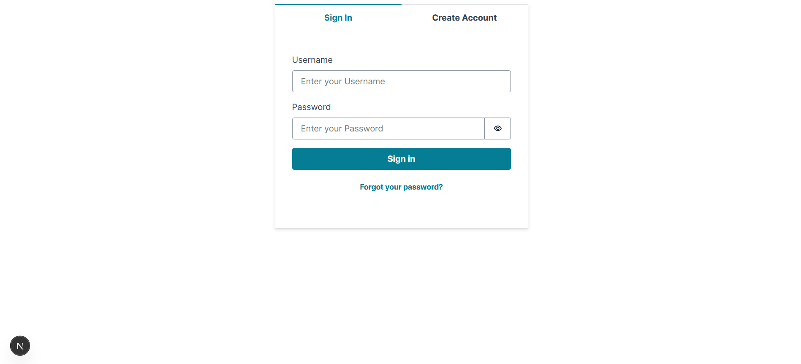
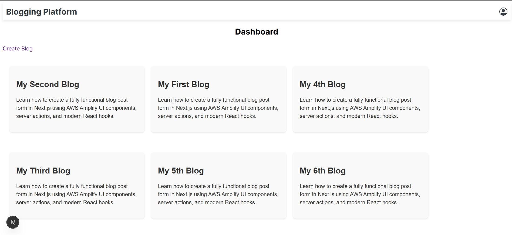
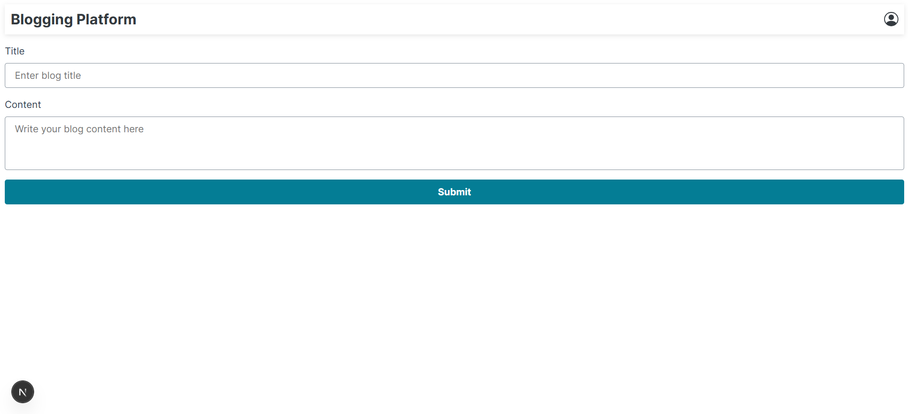
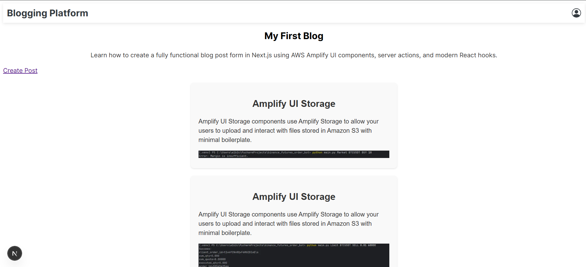
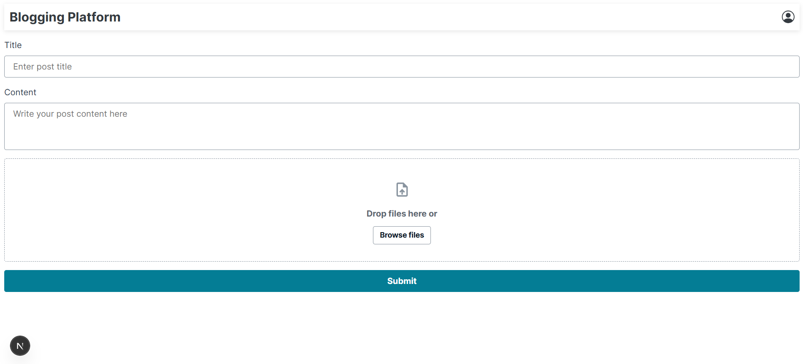
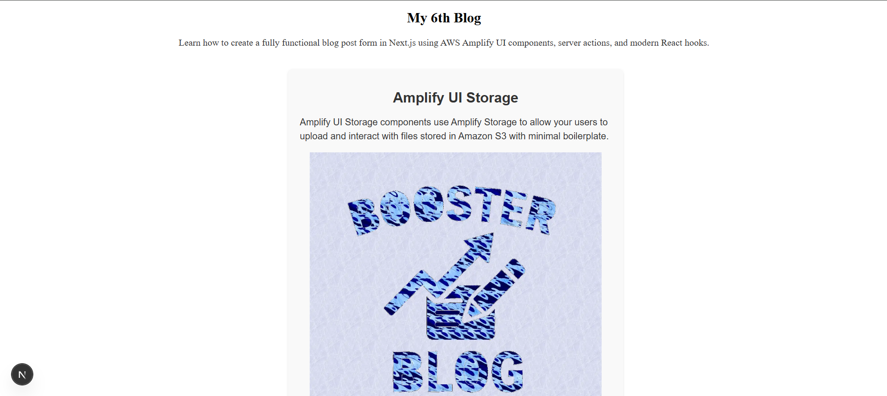

# Cloud-Based Multi-Tenant Blogging Platform

## Overview
A cloud-native blogging platform built using Next.js for the frontend and serverless backend services from
AWS. The application supports multi-tenant architecture, where users can create accounts, start blogs,
publish posts.

## Tech Stack
Frontend: Next.js 14 (App Router, TypeScript, Sass)
Authentication: Amazon Cognito
Database: Amazon DynamoDB (for blog metadata, users, posts)
Storage: Amazon S3 (for images)
API: AWS Amplify

## Features
1. User Accounts & Authentication
Register/login/logout via Cognito
Email verification and password reset
1. Multi-Tenant Blog Management
Each user can manage multiple blogs
Subdomain support: user.yourdomain.com
1. Create Posts
1. Blog Viewing

## Screenshots

